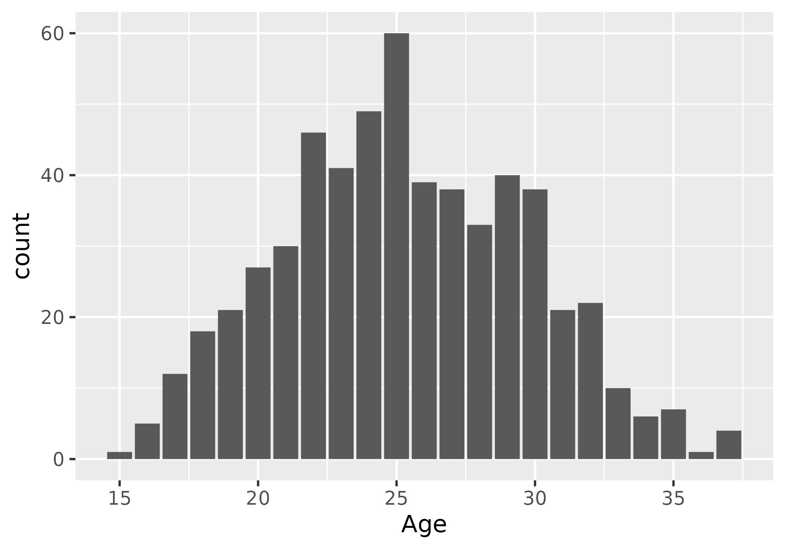
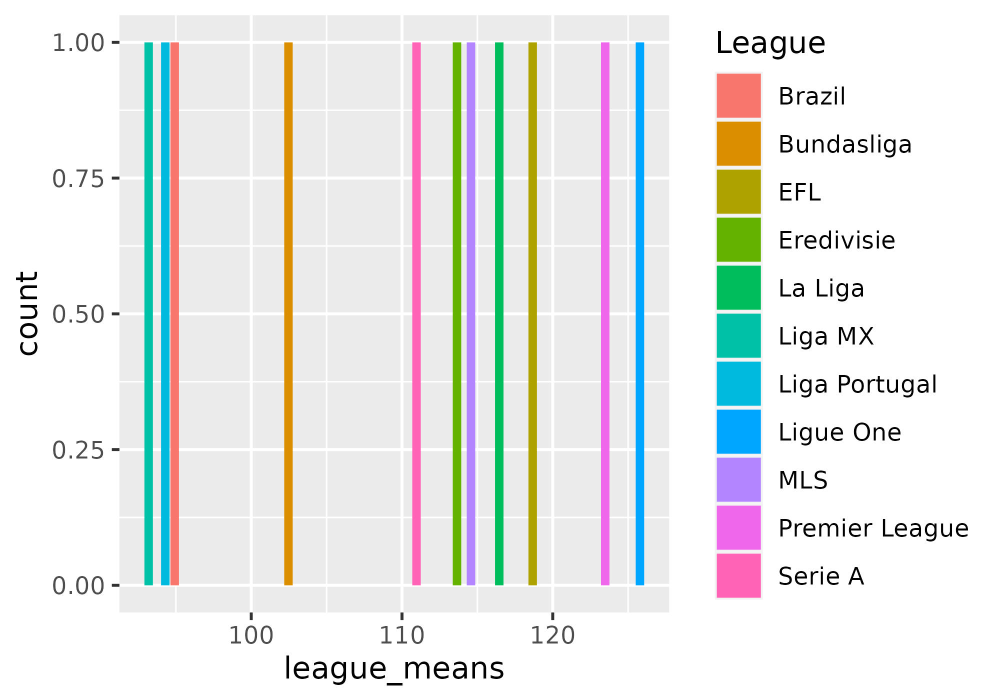

```{r setup, include=FALSE}
knitr::opts_chunk$set(echo = TRUE)
tinytex::install_tinytex(force = TRUE)
```

In this analysis, I will be using a data set, titled player_data_standard, that refers to individual players in European soccer clubs and their current affiliation, as well as standard statistics related to their season highlights.  

I will describe the meaning of the different KEY columns. 

Player - Player name 

Nation - Abbreviations (2 variations) of the Nation where the player originates from 

Pos - Position 

League - League affiliation

Squad - Squad (or team) affiliation 

Age - Age of player

Born - Year born 

MP - Matches played

Starts - Number of starts during the regular season 

Min - Minutes Played 

X90s - Number of minutes / 90, ie number of 'full game' lengths played in total 

Gls - Goals scored 

Ast - Assisted goals 

G.A - Goals and assists 

G.PK - Non-penalty goals

PK - Peanalty kicks made

PKatt - Penalty kicks attempted

CrdY - Yellow Cards

CrdR - Red Cards

xG - Expected goals scored

npxG- Non-penalty expected goals scored

xAG - Expected assisted goals 

PrgC - Progressive Carries

PrgP - Progressive passes

PrgR - progressive receptions 


As I began to work on this project, I realized a few key things.  First, while this dataset does include some very interesting information about players and their in game statistics, it lacks any sort of ranking system by which to identify players in terms of skill level.  If I were to redo the entire project, I would try to find a more robust dataset that is a better descriptor of overall player skill, which this data does not. 

As stated before, I want to determine if the Premier League is the best soccer league in Europe by looking at individual player quality. 

\newpage

# Cluster Analysis 

In order to get a better feel of our dataset, we can see the below cluster analysis which shows two clear clusters of variables. 

Below is a correlation plot that shows the correlation between some of the key numerical variables. 


{width=50%}


Next, I will show the two distinct clusters that can be found in the data. 

{width=50%}


Looking closely, the red cluster represents variables such as Gls, Ast, and Pk, which are sums of different actions throughout the year.  The blue cluster is mainly commprised by averages of goals or minutes, etc. as well as expected stats per game. 

\newpage

# Premier League - Player Age

Lets look at the Premier League more in depth. 

Below is a histogram of player age. 

{width=50%}


This shows that there is a good, approximately normal, distribution of ages with approximate age of about 25, and a good number of players below the 25 year old age mark.  Young teams are usually a sign of success when there are veteran players also on contract, and because this distribution is approximately normal, this seems promising in terms of player growth.  


\newpage

# Goals 

In terms of overall winningness, goal scoring is incredibly important.  I will first show a graph of number of goals scored by league, more specifically with a focus on the exceptional players with 10 or more goals a season. 


{width=50%}


The premier league does in fact have the two highest goal scorers per league!  


\newpage


# Progressive stats 


While looking at goals is one way to determine success, it can be argued that squad quality does not solely rely on goal scoring.  Many players are good without scoring goals, so instead I want to focus on progressive stats. These are counts of the number of plays (carries, passess, and receptions) that led to some form of progression in terms of field positioning or becoming closer to goal scoring.  It makes sense to assume that the more progressive plays that occur, the better a squad would be. 


Lets look at average progressive plays by league. 


{width=50%}


Premier League is actually second in terms of average progressive plays per player, with Ligue One in the lead. However, they are second highest in progressive plays, which shows that they are still in the contenders for first place.  


\newpage

# Takeaways

I think in order to make this project better, I would want to find another data set, or more data, that is related to clubs specifically, rather than just player stats.  For example, spending budgets and management statistics are really important in soccer.  Some clubs with massive amounts of funding are more likely to be successfull because they have better equipment, better managers and coaches, and the ability to purchase better quality players.  This would give a much more holistic view of a league or squad rather than just looking at players' in game abilities.  Injury reports would also be interesting to include, because these could hinder or change a players' goals scored in a season while not being representative of overall career abilities. 

Finally, I think it would be more interesting to create some sort of ideal player, in terms of the best combination of traits (maybe pulling from FIFA data) and testing this dataset against the ideal player to see what team has a real player that is most like this ideal player.  


